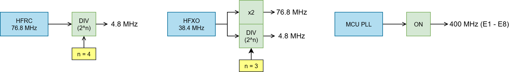
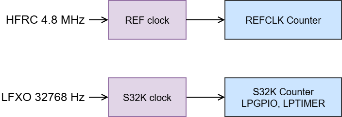
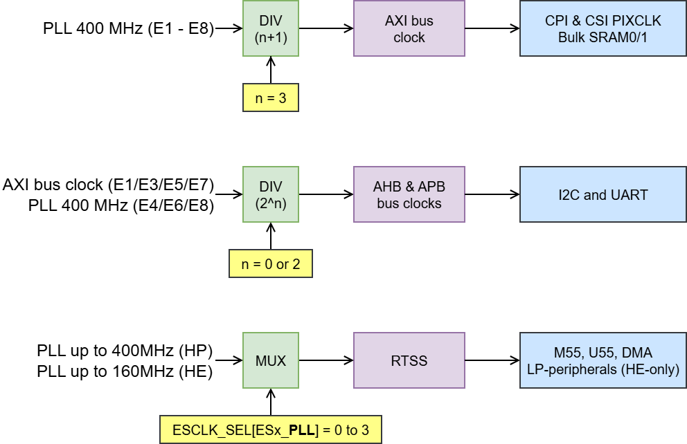

# Low Power Demo: Image Capture
This template application is built on top of the VSCode Getting Started Template (alif_vscode-template), but it is delivered for Alif Ensemble E7 and E8 Devkits only (Devkit-e7, Devkit-e8). The new **lp_cam** project is added to demonstrate a GPIO triggered image capture with dynamic frequency scaling to reduce power when idle in between frame captures.

- The solution consists of following projects:
  - **lp_cam** is the core Baremetal test application delivered by this software package
  - **blinky** is a bare bone LED blinker
  - **hello** demonstrates retargeting printf() to UART
  - **hello_rtt** demonstrates retargeting printf() to SEGGER RTT

## More detailed Getting Started Guide
Please refer to the [Getting Started Guide](doc/getting_started.md) written for the VSCode Getting Started Template before proceeding with this template application.

## Building the binaries
Open the directory using VSCode and switch to the CMSIS View (CTRL+SHIFT+ALT+S). Click the gear icon labeled "Manage Solution Settings". Here you will choose the Active Target. If you are planning to run this demo on the Devkit-e7, then you will want to build binaries for either the E7-HE or E7-HP. Otherwise, for the Devkit-e8, then build binaries for either the E8-HE or E8-HP. Use this Manage Solution tab to switch between Target Types and use the hammer icon in the CMSIS View to build the application. To build the template for a supported board other than the DevKit, you have to update the `board.h` file to pick the right variant of the board.

After the binaries are built, switch to the Explorer View (CTRL+SHIFT+E).
The binaries will be located in the out directory, for example:

    .
    ├── ...
    ├── out/
    │   ├── ...
    │   ├── lp_cam/
    │   |   ├── E7-HE/
    │   |   |   ├── debug/app_he.bin
    │   |   |   └── release/app_he.bin
    │   |   ├── E7-HP/
    │   |   |   ├── debug/app_hp.bin
    │   |   |   └── release/app_hp.bin
    │   |   ├── E8-HE/
    │   |   |   ├── debug/app_he.bin
    │   |   |   └── release/app_he.bin
    │   |   └── E8-HP/
    │   |       ├── debug/app_hp.bin
    │   |       └── release/app_hp.bin
    │   └── ...
    └── ...

## Debugging the binaries
- Switch to the Debug and Run view (CTRL+SHIFT+D) and press F5
- **TIP:** You may want to use SE tools integration to install the CPU stubs

## Programming the binaries
This program runs on only one core at a time. Use the built in tasks to program the binary to the device. This is done by following the "Programming the target with Alif Security Toolkit" step as described in the above "Getting Started Guide".

## Hardware Requirements
Camera modules supported by the demo application are:
- MT9M114: this is the default camera, commonly available
- ARX3A0: this is a less common camera module shipped in the past

**NOTE:** Ensemble DevKits do not ship with a camera by default. Please contact Alif to request.

**NOTE:** On DevKit-E8 the camera module should be connected to the backside of the board (connector J16)

**NOTE:** Jumper wire installed between P15_0 and P15_4 is needed for the "lptimer self test"

## Power Measurement
Refer to the power measurement points described in the [aiPM Examples User Guide](https://github.com/alifsemi/alif_ensemble-vscode-aiPMExamples/blob/main/Documentation/aiPM_Examples.md)

# About: Image Capture Demo
This application was written for GPIO pin triggered image capture with millisecond response time. Dynamic frequency scaling is employed to reduce power when idle in between frame captures. Application logging is done via printf-to-UART redirection.
  - RTSS-HE logs are on LP-UART (RX P9_1 and TX P9_2)
  - RTSS-HP logs are on UART4 (RX P12_1 and TX P12_2)

Changing the UART instance and pinmux is done via the retarget_config.h file.

    .
    ├── ...
    ├── device/
    │   ├── ensemble/
    │   |   ├── RTE/
    │   │   │   ├── Services/
    │   │   |   │   ├── AE722F80F55D5LS_M55_HE/retarget_config.h
    │   │   |   │   ├── AE722F80F55D5LS_M55_HP/retarget_config.h
    │   │   |   |   ├── AE822FA0E5597LS0_M55_HE/retarget_config.h
    │   │   |   |   └── AE822FA0E5597LS0_M55_HP/retarget_config.h
    │   │   │   └── ...
    │   │   └── ...
    │   └── ...
    └── ...

## Clock and Power Configuration
A simple "setup-then-loop" application architecture is used here. One-time configurations are done in the "run_on_reset()" function. Clocks, peripherals, pinmux, and timers are configured or started in this section. By the end of the "run_on_reset()" function the clock tree of the Alif MCU should be operating as follows:

Shown in this image are the top-level clock sources in the MCU, with all bus clocks, core clocks, and peripheral clocks being derived from these sources. The PLL is enabled and will be used only during the active periods of image capture. The HFRC and HFXO are enabled and divided to 4.8 MHz and will be used during inactive periods between image captures. To save power while idle, the MCU is switched to the 4.8 MHz sources and the PLL is disabled.

Timers used in this demo are the REFCLK Counter and the LPTIMER. The REFCLK Counter is driven by the REF clock at 4.8 MHz based on the HFRC divider configured earlier. The LPTIMER resides in the VBAT domain of the MCU and all these peripherals are clocked from the LFXO at 32768 Hz.

Peripherals used in this demo are the CPI and CSI for image capture, I2S for camera module configuration, and UART for the application logging. During the active periods of image capture, the clocks are sourced from PLL and divided down to the frequency needed. The PLL outputs a 400 MHz clock used by the AXI / AHB / APB buses and the RTSS-HP domain. The PLL also outputs a 160 MHz clock used by the RTSS-HE domain and its LP-peripherals. For optimal power draw during the image capture, the AXI bus is operating at 100 MHz although it supports up to 400 MHz operation. Using a higher frequency is possible, but it would use more power without benefiting the application. The AHB and APB buses are configured to run at 100MHz. During the idle period, all these clocks are switched to 4.8 MHz.

### Transition Down
During the idle period, the external camera module is placed in its low power state via an I2C command and stopping the XVCLK output which is driven from the Alif MCU to the camera module. Within the MCU, the CPI and CSI peripherals are clock gated and the CSI2 D-PHY is power gated. After the peripheral clocks are stopped, the bus and core clocks are switched from PLL to HFRC and the PLL is disabled. Finally, with the MCU power draw reduced low enough, we can request the DCDC to use PFM mode for additional power reduction. **Note:** the HFXO is kept enabled to improve the timing of the "transition up" sequence.

### Transition Up
During the active period, all the steps from the transition down are **done in reverse order**. The DCDC mode is switched to PWM mode, first. After that the PLL is started and the bus and core clocks are switched over to the higher frequency. Next, the peripheral clocks are started. Finally, the external camera module is taken out of its low power state by enabling the XVCLK output and sending an I2C command to start capturing frames.

To achieve the fastest response time from a GPIO pin trigger, the HFXO is kept running during the inactive period. This is because starting the HFXO is a process that takes nearly 1 millisecond. Otherwise, if the HFXO was stopped, then the transition up sequence would take nearly twice as long.

